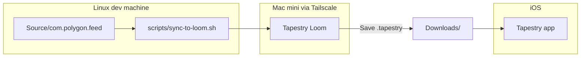
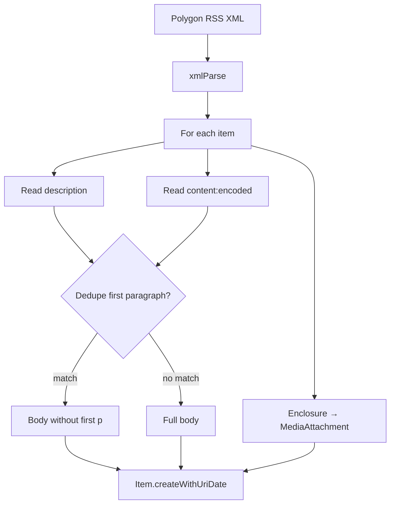

# Personal Tapestry Connectors — Polygon - Plan

## Goal Capsule

- **Objective:** Bootstrap a personal Tapestry Connectors repository and ship a Polygon-specific connector that fixes the missing favicon, removes duplicate intro text, and resolves bad text truncation compared to the built-in Blog Feed connector. Include a dev workflow to edit on Linux, sync to a Mac mini over Tailnet, test in Tapestry Loom, and install the packaged `.tapestry` on iOS.
- **Product authority:** This plan owns repo bootstrap, the Polygon connector v1, and the Loom testing workflow. A broader personal connector suite is contextual background, not active scope.
- **Execution profile:** Smoke-first verification in Tapestry Loom, then manual iOS acceptance. No automated connector test harness exists.
- **Stop conditions:** Pause implementation if Loom cannot load connector source from the synced path, or if truncation proves to be a Tapestry app preview limit with no connector-side workaround.
- **Tail ownership:** Developer runs sync, Loom validation, packaging, and iOS install.

---

## Product Contract

### Summary

A personal Tapestry Connectors repo modeled on chockenberry's layout, with a Polygon RSS connector as the first deliverable. v1 replaces the generic Blog Feed experience for Polygon with correct branding, cleaner article text, and a repeatable edit-sync-test-install loop via a remote Mac mini running Tapestry Loom.

### Problem Frame

Polygon is currently read through Tapestry's built-in Blog Feed (RSS/Atom) connector. The feed shows a generic globe icon instead of Polygon's favicon, repeats the article intro between the RSS description and body content, and truncates text in a way that degrades reading. The user wants a maintainable personal connector suite and a practical way to develop on Linux while testing with Loom on a Mac mini before installing connectors on iOS.

### Key Decisions

- **Site-specific Polygon fork over shared RSS library in v1** (session-settled: user-directed — chosen over shared module from day one: fastest path to a working connector; extract shared code when a second connector arrives). Governs R1, R3, R4.
- **Hardcoded Polygon favicon plus clean site URL in verification** (session-settled: user-approved — chosen over lookup-only: generic `lookupIcon()` fails for Polygon; belt-and-suspenders reliability). Governs R5.
- **Manual rsync + Loom open for v1 dev pipeline** (session-settled: user-directed — chosen over watch-and-reload: Loom reload behavior is unknown; validate before automating). Governs R9, R10.
- **v1 success bar is favicon + duplicate lede + truncation fixes** (session-settled: user-directed — chosen over favicon-only or full polish: explicit v1 boundary). Governs R5, R6, R7.

### Requirements

**Repository bootstrap**

- R1. The repository follows a chockenberry-style layout with connector source under `Source/`, packaged `.tapestry` outputs under `Downloads/`, and a README describing the project and how to install connectors.
- R2. The repository is initialized as a git repo with a sensible `.gitignore` for connector development artifacts.

**Polygon connector**

- R3. A dedicated Polygon connector exists with a unique reverse-domain id, a fixed Polygon main-feed URL, and connector metadata (display name, service name, default color) appropriate for Polygon.
- R4. The connector implements RSS loading and item parsing derived from the official `xml.feed` connector pattern, with Polygon-specific overrides for known feed quirks.
- R5. Polygon posts display the correct Polygon favicon in the Tapestry timeline — not the generic globe fallback.
- R6. Polygon posts do not show duplicate intro text caused by the RSS `<description>` overlapping with the opening of `<content:encoded>`.
- R7. Polygon post text is not badly truncated in the timeline; full readable article content displays to the extent Tapestry's item model allows.
- R8. Polygon posts preserve author bylines, hero images from RSS enclosures/media tags, and inline links within article body content.

**Dev and test workflow**

- R9. A documented workflow supports editing connector source on Linux, syncing changed files to a known directory on the Mac mini over Tailscale SSH, and opening that connector in Tapestry Loom for inspection and debugging.
- R10. A documented workflow supports packaging the connector as a `.tapestry` file and installing it on iOS for real-device validation after Loom testing passes.

### Actors

- A1. **Developer (you)** — authors connector source on Linux, runs sync/test scripts, validates in Loom and on iOS.
- A2. **Mac mini (remote over Tailnet)** — hosts Tapestry Loom for connector testing and packaging.
- A3. **Tapestry on iOS** — end-user app where the installed Polygon connector is consumed in the timeline.

### Key Flows

- F1. **Develop and test a connector change**
  - **Trigger:** Developer edits Polygon connector source on Linux.
  - **Actors:** A1, A2
  - **Steps:** Save changes locally → run sync to Mac mini → open connector folder in Tapestry Loom → inspect feed items (favicon, text, images) in Loom's timeline preview and web inspector → iterate until v1 criteria pass.
  - **Outcome:** Connector behavior matches R5–R8 in Loom before packaging.
  - **Covered by:** R9

- F2. **Install on iOS**
  - **Trigger:** Loom testing passes for a connector build.
  - **Actors:** A1, A3
  - **Steps:** Package connector as `.tapestry` → transfer to iOS (e.g. iCloud Drive) → install via Tapestry Settings → Connectors → Add a Connector → add Polygon feed → compare against prior Blog Feed experience.
  - **Outcome:** Installed connector replaces the generic Blog Feed setup for Polygon with improved presentation.
  - **Covered by:** R10

### Acceptance Examples

- AE1. **Favicon displays correctly**
  - **Covers R5.**
  - **Given:** A fresh Polygon feed added via the custom connector.
  - **When:** The timeline renders a Polygon post.
  - **Then:** The post header shows Polygon's favicon, not the generic globe icon.

- AE2. **No duplicate intro**
  - **Covers R6.**
  - **Given:** A Polygon article whose RSS `<description>` repeats the first paragraph of `<content:encoded>` (e.g. the My Hero Academia horror manga post).
  - **When:** The post renders in the timeline.
  - **Then:** The intro appears once, not as a short dek followed by the same paragraph in the body.

- AE3. **Readable body without bad truncation**
  - **Covers R7.**
  - **Given:** A Polygon article with a multi-paragraph `<content:encoded>` body.
  - **When:** The post renders in the timeline and the user reads the full item.
  - **Then:** Text is not cut off mid-sentence or mid-paragraph in a way that loses meaning; behavior is verified against the same article in the generic Blog Feed connector.

- AE4. **Media and byline preserved**
  - **Covers R8.**
  - **Given:** A Polygon article with `dc:creator`, an enclosure image, and inline hyperlinks.
  - **When:** The post renders.
  - **Then:** Author byline, hero image, and tappable inline links are present.

### Scope Boundaries

**Deferred for later**

- Public distribution (GitHub Releases, connector gallery submission).
- Link-preview card polish for embedded external sources (e.g. natalie.mu blocks).
- Additional Polygon section feeds or user-configurable feed URLs.
- Shared RSS parsing module extracted for reuse across connectors (refactor when connector #2 arrives).
- Auto-reload / watch-mode sync to Loom (pending Loom behavior validation).
- Connectors beyond Polygon.

**Outside this product's identity**

- Forking or modifying the official Tapestry app or Loom.
- Building a generic RSS connector replacement for all sites (Polygon-specific optimizations only).

<!-- ce-section: work-relationships -->

### How This Work Fits Together

This plan owns **repo bootstrap + Polygon connector v1 + Loom dev workflow**. The broader personal connector suite is the current understanding, not a committed roadmap:

- **Polygon connector v1** — active scope (this plan).
- **Additional site-specific connectors** — can proceed independently of each other once the repo scaffold and dev workflow exist; each would likely get its own plan.
- **Shared connector utilities** — depends on having 2+ connectors with overlapping parsing needs; deferred until then.

### Dependencies / Assumptions

- Tapestry Loom is installed on the Mac mini and can load connector source folders from a synced path.
- Tailscale SSH access to the Mac mini is configured and reliable from the Linux dev machine.
- Polygon's main RSS feed remains at `https://www.polygon.com/rss/index.xml` and continues using RSS 2.0 with `content:encoded`, `dc:creator`, and enclosure images.
- Polygon does not serve `/favicon.ico` (returns 404); favicon lives at `https://www.polygon.com/public/build/images/favicon-96x96.png`.
- The built-in `xml.feed` connector's `lookupIcon()` failure on Polygon is a contributing cause of the missing favicon; hardcoding mitigates regardless.
- Connector development follows the [Tapestry Connector API](https://github.com/TheIconfactory/Tapestry/blob/main/Documentation/API.md) and [connector authoring guidelines](https://usetapestry.com/connectors/).

### Outstanding Questions

**Resolved during planning**

- OQ3. Mac mini SSH host and sync path — captured in gitignored `scripts/loom.env` with `scripts/loom.env.example` template.

**Deferred to implementation (non-blocking)**

- OQ1. Truncation root cause — diagnose in U3 via Loom comparison against generic `xml.feed` on the same article; try `item_style`, body HTML structure, and paragraph dedupe before concluding app-level limit.
- OQ2. Duplicate intro sources — verify in Loom whether overlap is RSS field duplication only, or also Tapestry link-preview annotations on external links.
- OQ4. Loom hot-reload support — observe during first Loom session; document finding for v1.1 watch-mode decision.

### Sources / Research

- [Tapestry Connector API](https://github.com/TheIconfactory/Tapestry/blob/main/Documentation/API.md) — `verify()` icon handling, `lookupIcon()`, `Item` body model, connector file structure.
- [Tapestry connector authoring](https://usetapestry.com/connectors/) — `.tapestry` packaging, Loom for testing.
- [chockenberry/TapestryConnectors](https://github.com/chockenberry/TapestryConnectors) — repo layout (`Source/`, `Downloads/`), Verge connector as RSS fork precedent.
- [TheIconfactory/Tapestry `xml.feed`](https://github.com/TheIconfactory/Tapestry/blob/main/Plugins/xml.feed/plugin.js) — baseline RSS parsing logic to fork.
- Polygon RSS feed (`https://www.polygon.com/rss/index.xml`) — RSS 2.0 with `description`, `content:encoded`, `dc:creator`, enclosure images; channel `<link>` has trailing whitespace.

---

## Planning Contract

### Key Technical Decisions

- KTD1. **Connector id `com.polygon.feed`** — reverse-domain id following Tapestry conventions; distinct from generic `xml.feed`. Governs R3.
- KTD2. **Fork `xml.feed` plugin.js as the parsing baseline** — reuse `sendConditionalRequest`, RSS 2.0 item loop, `extractString`, enclosure/media attachment handling, and UTM stripping from the official connector (version 17). Governs R4.
- KTD3. **Hardcode favicon URL in `plugin-config.json` and `verify()`** — use `https://www.polygon.com/public/build/images/favicon-96x96.png` because Polygon's `/favicon.ico` returns 404 and `lookupIcon()` falls back to null. Governs R5.
- KTD4. **Description dedupe via normalized text comparison** — strip HTML from `<description>` and the first `
` of `<content:encoded>`; if they match (case-insensitive, whitespace-collapsed), omit the first paragraph from `item.body`. Governs R6.
- KTD5. **Truncation diagnosed before fixing** — compare generic vs custom connector in Loom on AE3 articles; adjust `item_style` (`article` vs `post`), ensure multi-paragraph HTML in body, and avoid setting redundant short text fields before concluding no connector fix exists. Governs R7.
- KTD6. **Dev sync via rsync over SSH** — `scripts/sync-to-loom.sh` reads `LOOM_HOST`, `LOOM_PATH`, and optional `LOOM_SSH_USER` from `scripts/loom.env`; Makefile exposes `make sync` and `make open-loom` (prints Loom open instructions). Governs R9.
- KTD7. **Package via Loom File → Save** — `.tapestry` files land in `Downloads/` with naming `com.polygon.feed.tapestry`; README documents iOS install path. Governs R10.

### High-Level Technical Design

Connector structure follows the Tapestry plugin layout: `plugin-config.json` + `plugin.js` + `README.md` under `Source/com.polygon.feed/`.

RSS item processing pipeline (directional):

### Assumptions

- Tapestry app version on iOS is ≥ 1.3 (required for `sendConditionalRequest` and async `xmlParse`).
- Developer has `rsync` and `ssh` available on Linux.
- Loom can open a connector by pointing at the synced folder containing `plugin-config.json` and `plugin.js`.

### Sequencing

1. U1 — repo scaffold and git init
2. U2 — Polygon connector skeleton (`plugin-config.json`, stub `plugin.js`, README)
3. U3 — RSS parsing fork + Polygon-specific dedupe/favicon/truncation fixes
4. U4 — dev workflow scripts and documentation
5. U5 — Loom smoke test, package `.tapestry`, iOS acceptance

---

## Implementation Units

### U1. Repository scaffold

- **Goal:** Create the personal connectors repo layout and baseline documentation.
- **Requirements:** R1, R2
- **Files:**
  - `README.md`
  - `.gitignore`
  - `LICENSE` (MIT, matching chockenberry reference)
  - `Source/.gitkeep`
  - `Downloads/.gitkeep`
- **Approach:** Initialize git. Mirror chockenberry's top-level structure. README covers project purpose, connector install steps (download `.tapestry` → Tapestry Settings → Connectors → Add), and links to Tapestry API docs.
- **Dependencies:** None
- **Test Scenarios:**
  - Repo contains `Source/` and `Downloads/` directories.
  - `git status` runs cleanly on a fresh clone.
- **Verification:** Manual directory and git check.

### U2. Polygon connector skeleton

- **Goal:** Create the connector identity and configuration with a no-op or passthrough `load()`.
- **Requirements:** R3
- **Files:**
  - `Source/com.polygon.feed/plugin-config.json`
  - `Source/com.polygon.feed/plugin.js` (stub)
  - `Source/com.polygon.feed/README.md`
- **Approach:** `plugin-config.json` sets `id: com.polygon.feed`, `display_name: Polygon`, `service_name: Gaming`, `default_color: green`, `site: https://www.polygon.com/rss/index.xml`, `icon: https://www.polygon.com/public/build/images/favicon-96x96.png`, `needs_verification: true`, `minimum_app_version: 1.3`, `item_style: article`, `version: 1`. Stub `verify()` returns hardcoded icon and display name. Stub `load()` fetches feed and calls `processResults([])` to confirm connectivity in Loom.
- **Dependencies:** U1
- **Test Scenarios:**
  - Loom loads connector without configuration errors.
  - `verify()` returns Polygon display name and favicon URL.
- **Verification:** Open in Loom after U4 sync; confirm connector appears in Loom with correct metadata.

### U3. RSS parsing and Polygon optimizations

- **Goal:** Implement full feed loading with favicon fix, dedupe, and truncation remediation.
- **Requirements:** R4, R5, R6, R7, R8
- **Files:**
  - `Source/com.polygon.feed/plugin.js`
- **Approach:** Fork RSS 2.0 path from `xml.feed` `plugin.js`: `sendConditionalRequest` with NetNewsWire-style user agent, item loop, `extractString`, enclosure → `MediaAttachment`, `dc:creator` → `Identity.createWithName`. Add `verify()` that sets `icon` from config and `baseUrl: https://www.polygon.com` (trimmed, no trailing space from feed's `<link>`). Add `dedupeDescriptionFromBody(description, bodyHtml)` helper: normalize both strings, compare, strip first `
` from body on match. For truncation (KTD5): after initial Loom test, if body still truncates, try ensuring `extractString` emits separate `
` blocks for multi-paragraph content and confirm `item_style: article`; log `item.body` length in Loom console for diagnosis.
- **Dependencies:** U2, U4 (for Loom testing)
- **Execution note:** Smoke-first — load connector in Loom and validate AE1–AE4 on known articles (My Hero Academia post for AE2, multi-paragraph article for AE3) before packaging.
- **Test Scenarios:**
  - **Happy path:** Latest Polygon feed items load with title, author, image, and body.
  - **AE2:** My Hero Academia article shows intro once.
  - **AE3:** Multi-paragraph article readable without mid-sentence cutoff vs generic connector.
  - **AE4:** Enclosure image and inline links present on a standard news post.
  - **Edge case:** Item with only `<description>` and no `content:encoded` still renders.
  - **Edge case:** Item where description differs from first paragraph keeps full body.
- **Verification:** Manual Loom inspection per AE1–AE4; compare side-by-side with generic `xml.feed` on same feed URL.

### U4. Loom dev workflow

- **Goal:** Enable edit-on-Linux, test-on-Mac-mini loop.
- **Requirements:** R9
- **Files:**
  - `scripts/loom.env.example`
  - `scripts/sync-to-loom.sh`
  - `Makefile`
  - `.gitignore` (add `scripts/loom.env`)
- **Approach:** `loom.env.example` documents `LOOM_HOST`, `LOOM_SSH_USER`, `LOOM_PATH` (remote directory where connector source is synced). `sync-to-loom.sh` rsyncs `Source/com.polygon.feed/` to `$LOOM_PATH/com.polygon.feed/` on the Mac mini. `Makefile` targets: `sync` (run script), `open-loom` (echo instructions to open synced path in Loom). README section documents one-time setup (copy `loom.env.example` → `loom.env`, fill in Tailscale hostname).
- **Dependencies:** U1
- **Test Scenarios:**
  - `make sync` completes without error when `loom.env` is configured.
  - Synced files on Mac mini match local `Source/com.polygon.feed/`.
  - Loom opens the synced connector folder and loads it.
- **Verification:** End-to-end sync + Loom load after editing `plugin.js` locally.

### U5. Package and iOS install

- **Goal:** Document and execute packaging for real-device validation.
- **Requirements:** R10
- **Files:**
  - `Downloads/com.polygon.feed.tapestry` (generated artifact, gitignored or committed per preference — default gitignore)
  - `README.md` (packaging section)
  - `.gitignore` (add `Downloads/*.tapestry` if not committing builds)
- **Approach:** After U3 passes Loom smoke tests, use Loom File → Save to write `com.polygon.feed.tapestry` into `Downloads/`. README documents transfer to iOS and installation. Remove or disable the old generic Blog Feed entry for Polygon on iOS and add the new connector feed.
- **Dependencies:** U3, U4
- **Test Scenarios:**
  - `.tapestry` file installs on iOS without errors.
  - Timeline shows Polygon favicon, deduped text, and acceptable truncation on AE2/AE3 articles.
- **Verification:** Manual iOS acceptance against AE1–AE4.

---

## Verification Contract

| Check | Command / action | Applies to |
|---|---|---|
| Repo layout | Confirm `Source/`, `Downloads/`, `README.md` exist | U1 |
| Sync workflow | `make sync` with configured `scripts/loom.env` | U4 |
| Loom smoke test | Load connector in Loom; verify feed items render per AE1–AE4 | U3 |
| Side-by-side comparison | Same Polygon URL in generic `xml.feed` vs `com.polygon.feed` | U3 |
| Package install | Install `Downloads/com.polygon.feed.tapestry` on iOS | U5 |

No automated unit test suite exists for Tapestry connector JavaScript. Verification is manual through Loom and iOS.

---

## Definition of Done

- [ ] Git repo initialized with chockenberry-style layout (R1, R2).
- [ ] `com.polygon.feed` connector loads in Tapestry Loom without errors (R3).
- [ ] Polygon favicon displays in timeline — AE1 passes on iOS (R5).
- [ ] Duplicate intro removed on known-bad article — AE2 passes in Loom and iOS (R6).
- [ ] Truncation acceptable on multi-paragraph article — AE3 passes or limitation documented (R7).
- [ ] Bylines, images, and links preserved — AE4 passes (R8).
- [ ] `make sync` workflow documented and working over Tailscale SSH (R9).
- [ ] `.tapestry` packages and installs on iOS (R10).
- [ ] README covers dev workflow, packaging, and install.
