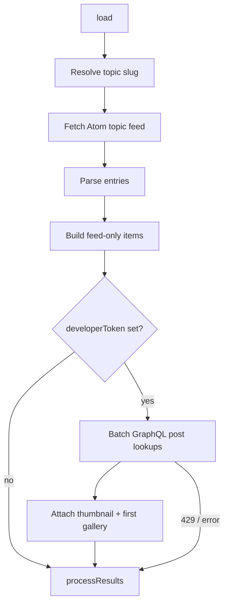
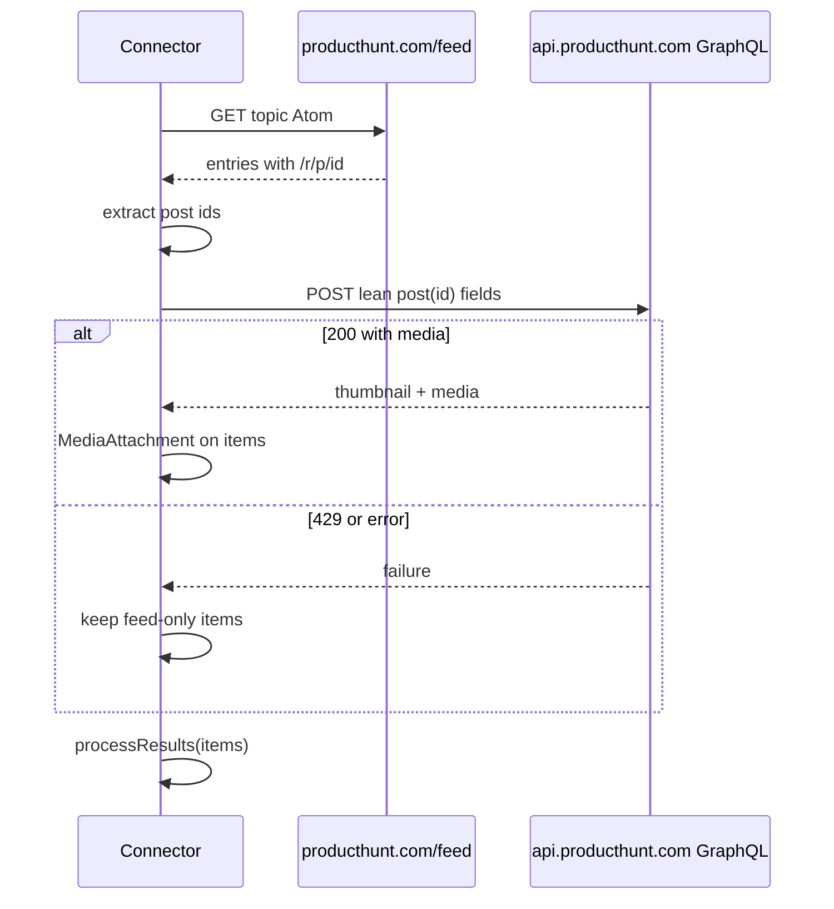

# Product Hunt Topic Feed Connector - Plan

## Goal Capsule

- **Objective:** Ship `com.producthunt.feed` — a Product Hunt Tapestry connector that loads a topic Atom feed (default `tech`) with branded presentation, and optionally enriches items with thumbnail + first gallery image via a pasted developer token while staying inside Product Hunt rate limits.
- **Product authority:** This Product Contract owns connector behavior, enrichment rules, topic configuration, and success criteria.
- **Execution profile:** Smoke-first verification (feed shape + optional API enrichment script); Loom/iOS for visual acceptance. No automated connector JS unit harness exists in this repo.
- **Stop conditions:** Pause if Atom entries lose both the structured `Post/<id>` entry id and the `/r/p/<id>` join key with no alternate public in-feed lookup that avoids HTML scraping; or if GraphQL enrichment cannot return media under personal-token auth.
- **Open blockers:** None.

---

## Product Contract

### Summary

A dedicated Product Hunt connector for Tapestry. Without a token it improves on the generic Blog Feed experience for PH topic feeds. With an optional developer token it attaches thumbnail and first gallery images that the Atom feed does not expose.

This plan covers the full brainstorm scope (connector + packaging/docs), extends existing feed and optional-enrichment patterns, and verifies with smoke-first checks for feed-only and token-enriched loads. Adjacent reactor/YouTube refactors stay out.

### Problem Frame

Product Hunt’s Atom topic feed (`/feed?category=…`) returns launches with title, tagline, maker, and discussion/link markup, but no media. Timeline cards are text-only. Product HTML pages are Cloudflare-protected, so Uncrate-style page scraping is unreliable. Product Hunt’s GraphQL API exposes `thumbnail` and `media` and is reachable with a personal developer token (verified in session).

### Key Decisions

- **Feed-first with optional API enrichment** (session-settled: user-directed — chosen over feed-only or API-only: works without a key; API unlocks screenshots when available). Governs R3–R7.
- **Never scrape product HTML for media** (session-settled: user-approved — chosen over page enrichment: Cloudflare challenges block reliable fetches). Governs R6.
- **v1 enrichment = thumbnail + first gallery image** (session-settled: user-directed — chosen over thumbnail-only or full meta: biggest visual win within a lean query). Governs R5.
- **Votes / day rank are stretch** (session-settled: user-directed — chosen over hard-required meta: include only if complexity/quota findings allow). Governs R9.
- **Configurable topic slug, default `tech`** (session-settled: user-directed — chosen over tech-hardcoded: reuse one connector across PH topics). Governs R2.
- **Developer Token pasted into connector settings** (session-settled: user-approved — chosen over in-app OAuth: personal connector; token already obtained). Governs R4.

### Requirements

**Connector identity and feed**

- R1. A dedicated connector exists with a unique reverse-domain id, Product Hunt branding (display name, icon, default color), and `item_style` appropriate for launch cards in the timeline.
- R2. The connector accepts a topic slug setting that defaults to `tech` and loads `https://www.producthunt.com/feed?category=<slug>`.
- R3. Without a developer token, the connector still loads and renders feed items: product name, tagline, maker when present, discussion link, and product/outbound link, with branded feed identity (not the generic Blog Feed globe).

**Optional API enrichment**

- R4. An optional developer token setting enables GraphQL enrichment against Product Hunt’s API.
- R5. When the token is present and valid, each rendered item may include a hero image from the post thumbnail and, when available, the first gallery media image.
- R6. Enrichment uses the official API only (no product-page HTML fetch).
- R7. Enrichment respects Product Hunt rate limits (GraphQL complexity quota per 15 minutes). The connector must not hammer the API: prefer lean queries, bound work per refresh, and on HTTP 429 still return feed-only items rather than failing the whole load.
- R8. Invalid or missing tokens never break the feed path; items degrade to feed-only presentation.
- R9. Stretch (non-blocking for v1): when enrichment runs and quota allows, surface light meta such as vote count and/or day rank without displacing thumbnail + first gallery as the primary enrichment.

**Packaging and docs**

- R10. The connector is wired into the repo build/package list, README, and changelog release notes pattern used by other connectors.
- R11. README documents how to create a Product Hunt developer token and paste it into the connector setting.

### Actors

- A1. **Reader** — consumes Product Hunt launches in Tapestry timeline (iOS) or Loom preview.
- A2. **Connector author** — configures topic slug and optional developer token; develops and packages the connector.

### Key Flows

- F1. **Subscribe without developer token**
  - **Trigger:** Reader adds the Product Hunt connector with default or custom topic, no token.
  - **Steps:** Connector fetches the topic Atom feed → parses entries → renders branded cards with title, tagline, maker, links.
  - **Outcome:** Usable tech (or other topic) feed without screenshots.
  - **Covered by:** R1–R3

- F2. **Subscribe with developer token**
  - **Trigger:** Reader pastes a developer token and refreshes.
  - **Steps:** Feed loads as in F1 → connector enriches items via GraphQL for thumbnail + first gallery image within rate limits → timeline shows media attachments.
  - **Outcome:** Same feed with screenshots when API data is available.
  - **Covered by:** R4–R7

- F3. **Rate limit or API failure**
  - **Trigger:** API returns 429 or errors during enrichment.
  - **Steps:** Connector stops or skips further enrichment for that refresh → still `processResults` with feed-parsed items.
  - **Outcome:** Timeline remains populated; media may be missing for some or all items that refresh.
  - **Covered by:** R7, R8

### Acceptance Examples

- AE1. **Feed works without token**
  - **Covers R3.**
  - **Given:** Topic `tech`, empty token.
  - **When:** Load runs in Loom.
  - **Then:** Multiple launch cards appear with Product Hunt branding, name, tagline, and links; no crash.

- AE2. **Screenshots with token**
  - **Covers R5, R6.**
  - **Given:** Valid developer token and topic `tech`.
  - **When:** Load runs in Loom.
  - **Then:** At least some recent items show a thumbnail and/or gallery image attachment sourced from the API (not scraped HTML).

- AE3. **Topic override**
  - **Covers R2.**
  - **Given:** Topic slug set to a non-tech category that has a working `/feed?category=` feed.
  - **When:** Load runs.
  - **Then:** Items reflect that topic’s feed, not hard-coded tech-only content.

- AE4. **429 does not empty the timeline**
  - **Covers R7, R8.**
  - **Given:** Token present but enrichment hits rate limit mid-refresh (or simulated).
  - **When:** Load completes.
  - **Then:** Feed items still appear; enrichment may be partial or absent for that refresh.

### Scope Boundaries

- No scraping of `producthunt.com` product/post HTML for images or meta.
- No full OAuth authorize/redirect flow inside Tapestry; Developer Token paste only for v1.
- No Product Hunt write actions (upvote, comment, follow).
- No multi-topic fan-in in one feed instance (one topic slug per feed).
- Stories/newsletter editorial RSS is out of scope (no reliable public feed found).

### Deferred for later

- Stretch meta polish beyond a lean `votesCount` / `dailyRank` when those fields fit the batch query.
- In-app OAuth if personal token paste proves too awkward for multi-user distribution.

### Outside this product's identity

- Product Hunt as a write/social client.
- A general Cloudflare-bypass scraper for PH HTML.

### Deferred to Follow-Up Work

- Refactors of Reactor or YouTube playlist connectors unrelated to PH.
- Shared cross-connector GraphQL helper library (keep enrichment local to this connector for v1).

### Assumptions

- Topic Atom feeds remain publicly available at `https://www.producthunt.com/feed?category=<slug>` without authentication.
- GraphQL `thumbnail` / `media` remain available to developer tokens for public posts.
- Atom entries expose a GraphQL-usable post id via structured entry `<id>` (`…Post/<id>`) and/or `/r/p/<id>` in content (confirmed in planning research).
- Personal use of one developer token under published rate limits is acceptable for this connector’s refresh patterns once U3 sets an explicit max enrichment IDs per refresh from measured `X-Rate-Limit-*` cost.

### Outstanding Questions

**Resolved in planning**

- OQ1. Atom→API join: primary key is Atom entry `<id>` (`Post/<id>`); secondary fallback `/r/p/<id>` from content/links → GraphQL `post(id:)` (see KTD4).
- OQ2. Stretch meta: attempt `votesCount` and `dailyRank` in the same lean batch query; drop them at implementation time if complexity or response shape makes media enrichment unreliable (R9 remains non-blocking).
- OQ3. Connector id is `com.producthunt.feed` (see KTD1).

**Deferred (non-blocking)**

- Exact max enrichment IDs per refresh — measure during U3 from `X-Rate-Limit-Remaining` delta for one lean `post(id:)` media query and record the cap in code comments / connector README.

### Success Criteria

- Default tech topic feed is clearly better than Blog Feed on Atom alone (branding + clean card text).
- With a token, screenshots appear for enriched items without Cloudflare scraping.
- Missing/invalid token or API 429 never blanks the feed.
- Topic slug setting works for at least one non-default topic that PH exposes via Atom.
- Docs are enough for the author to recreate token setup and install the connector.

---

## Planning Contract

**Product Contract preservation:** Product Contract unchanged (requirements, flows, AEs, and session-settled Key Decisions preserved; OQ1–OQ3 resolved into KTDs).

### Key Technical Decisions

- KTD1. **Connector id `com.producthunt.feed`** — reverse-domain id consistent with other `com.*.feed` connectors; resolves OQ3. Governs R1.
- KTD2. **Original PH-colored text-mark icon ("PH")** — generate via `version.json` + `scripts/build-icon.sh` pattern (as Reactor’s "R"); host HTTPS GitHub raw URL with `?v=` cache-buster. Avoid official Product Hunt logo assets (trademark). No data-URI icons (Loom breakage lesson). Governs R1.
- KTD3. **Topic-built Atom URL with conditional-GET fallback** — set `plugin-config.json` `site` to `https://www.producthunt.com/feed?category=tech` (no free-form URL prompt). At load time build `feedUrl` from `topic` (fallback `tech`) and call `sendConditionalRequest`/`sendRequest` on that URL — not the `site` global. Empty conditional response falls back to full GET (Reactor/Cool Material). Parse Atom `feed.entry` (YouTube playlist pattern) with raw `<entry>` regex fallback if needed. Set `verify_variables: true` because topic changes the feed URL. Governs R2, R3, F1.
- KTD4. **Join Atom→API via entry id, `/r/p/` fallback** — primary: parse numeric id from Atom entry `<id>` (`…Post/<id>`); secondary: `/r/p/<id>` in content/links. Accept only `/^[0-9]+$/` ids; skip others. Look up with GraphQL `post(id:)` using variables or numeric-only literals (never raw Atom string interpolation into the query document). Hard rate-limit control is a measured max post IDs per refresh; batched vs sequential `sendRequest` is subordinate transport. Never fetch product HTML. Governs R5–R8, OQ1.
- KTD5. **Manual Bearer GraphQL POST on API host only** — `ui-config.json` text inputs `topic` (default `tech`) and `developerToken`. Call `sendRequest("https://api.producthunt.com/v2/api/graphql", "POST", JSON.stringify({ query, variables }), { Authorization: "Bearer " + token, "Content-Type": "application/json", Accept: "application/json" }, true)`. Parse `status`/`headers`/`body` from the fullResponse object. Never attach that Authorization headers object to Atom feed requests. Do not rely on Tapestry auto-auth against `site` (feed host ≠ API host). Governs R4, R5.
- KTD6. **Enrichment failure never blanks feed** — missing/invalid token skips API; GraphQL errors or HTTP 429 (`status === 429`) stop further enrichment for that refresh and still `processResults` feed items (Uncrate enrichment try/catch posture + Reactor empty-response discipline). Never log, print, or assert-dump `developerToken`, `PRODUCTHUNT_TOKEN`, or Authorization header values; on failure record only HTTP status and non-sensitive error codes. Governs R7, R8, F3, AE4.
- KTD7. **Lean media query; stretch meta best-effort; measured ID cap** — required fields: `thumbnail { url }`, `media { url }` (take first image-like entry). Only attach URLs that start with `https://`. Optionally include `votesCount` and `dailyRank` in the same query when cheap; if complexity or schema issues threaten media reliability, omit stretch fields rather than fail v1. During U3, measure `X-Rate-Limit-Remaining` delta for one lean lookup and set an explicit max enrichment IDs per refresh from that cost (do not assume ~6250 covers a full ~50-entry page). Surface stretch as short body/annotation text when present. Governs R5, R9.
- KTD8. **Card presentation: `item_style: post` + feed identity avatar** — match Reactor: branded avatar on each item; body carries tagline, maker when present, discussion/product links from Atom; attachments hold thumbnail and optional gallery image. Governs R1, R3.
- KTD9. **Smoke-first verification** — add `scripts/smoke-producthunt-feed.sh` for Atom shape + join-key presence; optional token path when `PRODUCTHUNT_TOKEN` is set. Wire connector into `Makefile` `CONNECTORS`, README table, and CHANGELOG. Governs R10, R11.

### High-Level Technical Design



Enrichment join (directional):



### Assumptions

- Tapestry ≥ 1.3 for async `xmlParse` / conditional request APIs used by sibling connectors.
- `ui-config.json` text variables are injected into `plugin.js` as named globals (Tapestry API).
- After U3 measures per-lookup complexity cost, a bounded ID cap keeps one personal topic refresh inside the GraphQL 6250 / 15 min budget shared by the PH app credentials.

### Sequencing

1. U1 — connector scaffold, branding, settings
2. U2 — Atom feed load, branded cards, create feed-only smoke script
3. U3 — GraphQL enrichment + rate-limit safety + stretch meta; extend smoke for token path
4. U4 — finalize smoke, Makefile/README/CHANGELOG packaging

### Risks & Dependencies

| Risk | Mitigation |
|---|---|
| Cloudflare or feed shape change removes both Atom `Post/<id>` and `/r/p/<id>` | Smoke asserts primary + fallback join keys; stop condition if both gone; no HTML scrape fallback |
| GraphQL complexity burns quota mid-refresh | Lean fields; measured max IDs per refresh from `X-Rate-Limit-*`; stop enrichment on 429 |
| Official logo trademark issues | Use original text-mark icon only (KTD2) |
| Token pasted in settings is sensitive | Never commit tokens; never log/echo token or Authorization; smoke via env only without stdout dump |

### Sources & Research

- Product Hunt rate limits: GraphQL complexity 6250 / 15 min; respect `X-Rate-Limit-*` and HTTP 429 ([API docs](https://api.producthunt.com/v2/docs/rate_limits/headers)).
- GraphQL `post(id:)` fields: `thumbnail`, `media`, `votesCount`, `dailyRank` ([schema / query docs](https://api-v2-docs.producthunt.com/query/post/)).
- Tapestry `ui-config.json` text inputs and `sendRequest` extraHeaders ([API.md](https://github.com/TheIconfactory/Tapestry/blob/main/Documentation/API.md)).
- Local patterns: `Source/com.reactor.feed/` (conditional-GET fallback, `item_style: post`, text-mark icon), `Source/com.uncrate.feed/` (enrichment failure → still emit), `Source/com.newtosh.youtube.playlist/` (Atom entry parse).

---

## Output Structure

```text
Source/com.producthunt.feed/
  plugin-config.json
  plugin.js
  ui-config.json
  version.json
  icon.png                 # generated
  resources/icon-url.txt   # generated
  README.md
scripts/smoke-producthunt-feed.sh
```

---

## Implementation Units

### U1. Connector scaffold and branding

**Goal:** Create `com.producthunt.feed` identity, settings, and PH text-mark icon so Loom can load the connector shell.

**Requirements:** R1, R2, R4 (settings); R11 (README stub; complete in U4); KTD1, KTD2, KTD3, KTD5

**Dependencies:** None

**Files:**
- Create: `Source/com.producthunt.feed/plugin-config.json`
- Create: `Source/com.producthunt.feed/plugin.js` (stub `verify` / `load`)
- Create: `Source/com.producthunt.feed/ui-config.json`
- Create: `Source/com.producthunt.feed/version.json`
- Create: `Source/com.producthunt.feed/README.md` (token setup stub ok; expand in U4)
- Create: `Source/com.producthunt.feed/icon.png` (via build)
- Create: `Source/com.producthunt.feed/resources/icon-url.txt` (via build)

**Approach:** Follow Reactor packaging: `id`/`semver`/`tapestry_version`, HTTPS icon URL with `?v=`, `item_style: post`, `needs_verification: true`, `verify_variables: true`, `provides_attachments: true`, `default_color` from allowed palette (prefer coral/orange closest to PH orange). Set `site` to `https://www.producthunt.com/feed?category=tech`. `ui-config.json` defines `topic` (text, default `tech`) and `developerToken` (text, empty default, placeholder explaining Developer Token). Stub `verify()` returns Product Hunt display name + icon; stub `load()` may `processResults([])` until U2.

**Patterns to follow:** `Source/com.reactor.feed/plugin-config.json`, `version.json`, `Source/com.newtosh.youtube.playlist/ui-config.json` (settings shape).

**Test scenarios:**
- Happy path: `CONNECTOR_ID=com.producthunt.feed make build` produces icon URL file and assets.
- Edge case: `plugin-config.json` `id` equals `com.producthunt.feed` and icon URL is HTTPS (not data-URI).
- Error path: missing `resources/icon-url.txt` before build fails loudly in `loadIconUrl` once U2 wires it (same as Reactor).

**Verification:** Build succeeds; Loom opens the connector folder without config errors; settings show topic + developer token fields.

---

### U2. Atom feed parse and branded cards

**Goal:** Load topic Atom feeds into branded timeline cards without any API token.

**Requirements:** R2, R3, F1, AE1, AE3; KTD3, KTD8

**Dependencies:** U1

**Files:**
- Modify: `Source/com.producthunt.feed/plugin.js`
- Create: `scripts/smoke-producthunt-feed.sh` (feed-only assertions; token path may stub until U3)
- Test: `scripts/smoke-producthunt-feed.sh`

**Approach:** Build `feedUrl` from `topic` (fallback `tech`) and fetch that URL with conditional-GET → `sendRequest` fallback (do not fetch the `site` global when topic differs). Parse Atom entries for title, summary/content, published date, links, and structured entry `<id>`. Extract maker/tagline from entry markup when present. Set `resultItem.author` to Product Hunt feed identity (icon avatar). Do not call GraphQL in this unit. Ensure empty conditional responses do not wipe results when a full GET still works. Smoke asserts presence of `Post/<id>` and/or `/r/p/<id>` join keys on sampled entries.

**Execution note:** Smoke-first against live `https://www.producthunt.com/feed?category=tech` before Loom polish.

**Patterns to follow:** `Source/com.reactor.feed/plugin.js` load/fallback; `Source/com.newtosh.youtube.playlist/plugin.js` Atom entry handling.

**Test scenarios:**
- Happy path / Covers AE1: topic `tech`, no token → multiple items with title and non-empty body/links.
- Happy path / Covers AE3: non-default topic slug with a working category feed returns that topic’s items (not hard-coded tech titles).
- Edge case: entry missing both join keys still renders feed-only card.
- Edge case: conditional GET empty then full GET succeeds → non-empty `processResults`.
- Error path: feed fetch failure → empty results without throw that kills the connector.

**Verification:** Smoke script passes feed-only checks; Loom shows branded PH cards without screenshots.

---

### U3. GraphQL enrichment and rate-limit safety

**Goal:** When `developerToken` is set, enrich items with thumbnail + first gallery image; never blank the feed on API failure; attempt stretch meta when cheap.

**Requirements:** R4–R9, F2, F3, AE2, AE4; KTD4, KTD5, KTD6, KTD7

**Dependencies:** U2

**Files:**
- Modify: `Source/com.producthunt.feed/plugin.js`
- Modify: `scripts/smoke-producthunt-feed.sh` (optional `PRODUCTHUNT_TOKEN` enrichment checks)
- Test: `scripts/smoke-producthunt-feed.sh`

**Approach:** After feed parse, resolve post ids per KTD4 (Atom `Post/<id>` primary, `/r/p/` fallback; digit allowlist). If token empty/whitespace, skip enrichment. Otherwise call GraphQL per KTD5 (`fullResponse: true`, JSON body, Bearer only on the hardcoded API URL). Cap enrichment to the measured max IDs per refresh (KTD7); treat batch vs sequential as transport under that cap. Map `https://` thumbnail and first usable gallery URLs to `MediaAttachment`s. On `status === 429`, GraphQL errors, or parse failures: stop enrichment for the refresh and emit feed items. Stretch: include `votesCount`/`dailyRank` when the lean query remains stable; if not, omit without failing media. Never log the token; never `sendRequest` product HTML pages.

**Execution note:** Prove join + media with a real token in smoke/Loom; record rate-limit delta for one lean lookup before choosing the ID cap; simulate or force 429 handling by short-circuiting after a synthetic failure path if live 429 is unavailable.

**Patterns to follow:** Uncrate `enrichFromArticlePage` try/catch returning null; Reactor always-emit discipline; PH API rate-limit headers docs; Tapestry `sendRequest` fullResponse mode.

**Test scenarios:**
- Happy path / Covers AE2: valid token → at least some items gain HTTPS image attachments from API fields.
- Happy path: stretch fields present → vote/rank appear as light meta without replacing images (non-blocking if omitted).
- Edge case: token set but entry lacks both join keys → feed item without media, no crash.
- Edge case: non-digit pseudo-id in markup → skipped for GraphQL, feed card still emits.
- Edge case: API returns thumbnail only → single attachment; gallery optional.
- Error path / Covers AE4: 429 or GraphQL error mid-enrichment → feed items still emitted.
- Error path: invalid token → feed-only items, no connector crash.
- Integration: feed-only path with empty token unchanged from U2 behavior.

**Verification:** Smoke with `PRODUCTHUNT_TOKEN` shows media URLs for joined ids; Loom AE2/AE4 pass; no product HTML fetches in code paths.

---

### U4. Packaging, docs, and changelog

**Goal:** Wire the connector into repo release machinery and document token setup.

**Requirements:** R10, R11; KTD9

**Dependencies:** U1, U2, U3

**Files:**
- Modify: `Makefile` (`CONNECTORS` list)
- Modify: `README.md` (table + token setup pointer)
- Modify: `CHANGELOG.md` (Unreleased / connector section)
- Modify: `Source/com.producthunt.feed/README.md`
- Modify: `scripts/smoke-producthunt-feed.sh` (finalize)

**Approach:** Add `com.producthunt.feed` to `CONNECTORS`. Document: create PH API app → Developer Token → paste into connector setting; topic slug default `tech`; note rate limits and feed-first degradation. Changelog entry follows repo pattern so auto-release notes stay accurate. Package via existing `make package` / Loom save path used by other connectors.

**Test scenarios:**
- Happy path: `make build` / `make package` include `com.producthunt.feed`.
- Happy path: README explains token creation and paste without requiring OAuth.
- Edge case: README states feed works with empty token.

**Test expectation:** none beyond packaging/docs checks and existing smoke — no new behavioral surface beyond wiring.

**Verification:** Package artifact exists; README/CHANGELOG mention the connector; smoke still green.

---

## Verification Contract

| Check | Command / action | Applies to |
|---|---|---|
| Build assets | `CONNECTOR_ID=com.producthunt.feed make build` | U1, U4 |
| Feed smoke | `scripts/smoke-producthunt-feed.sh` | U2 |
| Enrichment smoke | `PRODUCTHUNT_TOKEN=… scripts/smoke-producthunt-feed.sh` | U3 |
| Package | `CONNECTOR_ID=com.producthunt.feed make package` | U4 |
| Loom AE1–AE4 | Manual load in Tapestry Loom | U2, U3 |
| iOS install | Install packaged `.tapestry` after Loom pass | U4 |

No automated JS unit test harness for connectors; smoke + Loom are the quality bar.

---

## Definition of Done

- [ ] `com.producthunt.feed` exists with PH text-mark icon and `item_style: post` (R1, KTD1, KTD2).
- [ ] Topic slug setting defaults to `tech` and loads the matching Atom feed (R2, AE3).
- [ ] Feed-only path renders branded launch cards without a token (R3, AE1).
- [ ] With a developer token, thumbnail and/or first gallery image attach for joined posts (R4–R6, AE2).
- [ ] No product HTML scraping paths (R6, Scope Boundaries).
- [ ] API 429 / invalid token leaves feed items intact (R7, R8, AE4).
- [ ] Stretch votes/day rank included when lean query allows; otherwise documented omit (R9).
- [ ] Makefile, README, CHANGELOG, and smoke script wired (R10, R11).
- [ ] Verification Contract checks above pass for the units that landed.
